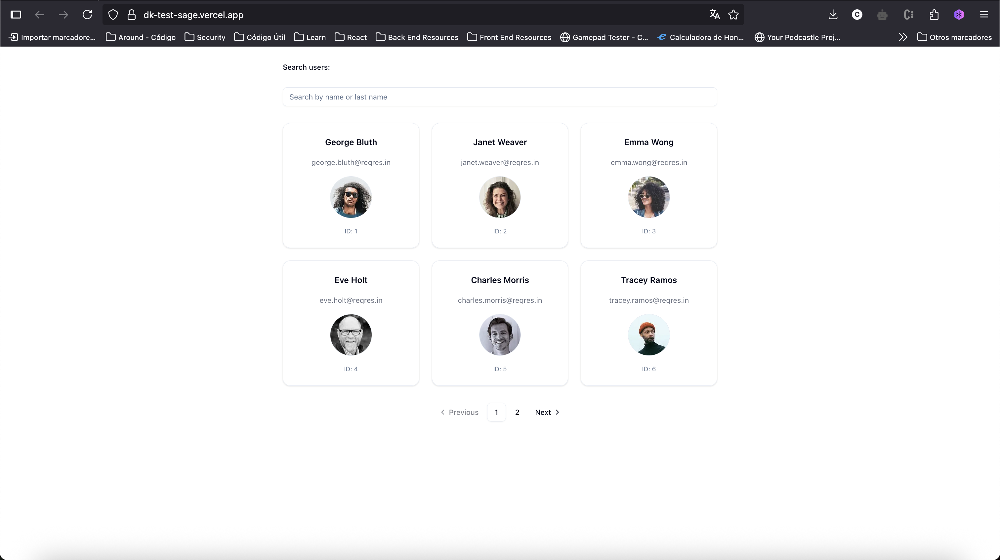
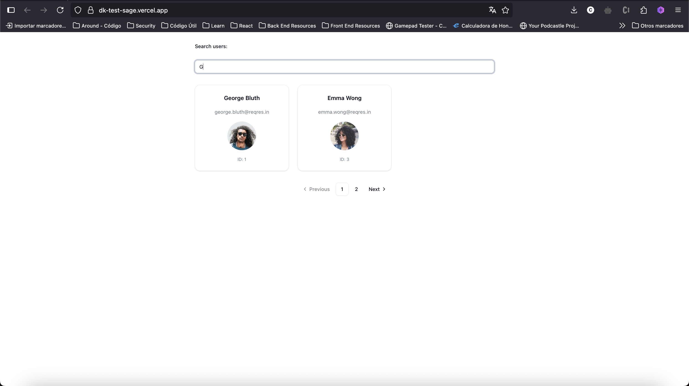
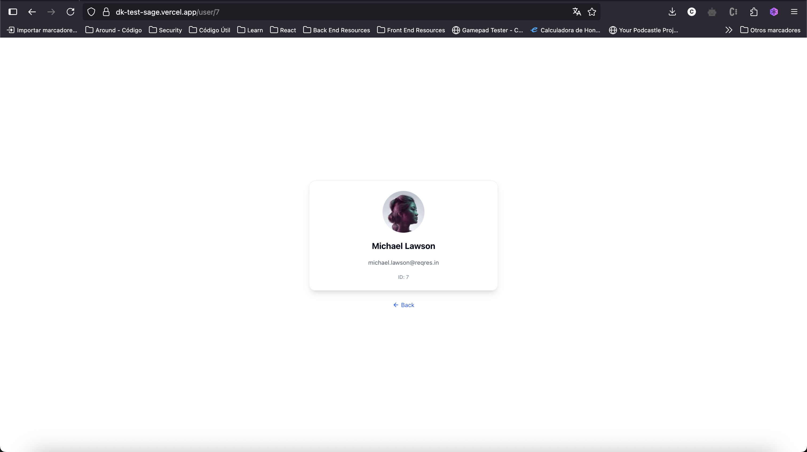
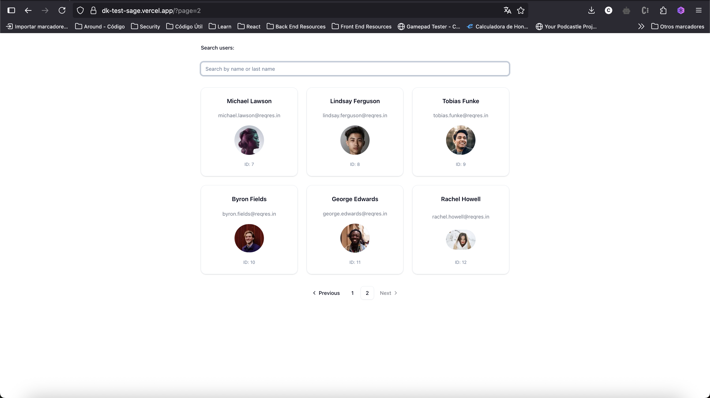

Diagnostikare Frontend Technical Challenge

## This project is a technical solution for the frontend challenge using Next.js 15 (App Router), TypeScript, TailwindCSS, and ShadCN UI.

### FEATURES
- User list with avatar, full name and email.
- Pagination support from the API.
- Client-side search by name or last name.
- Fully responsive layout (mobile-first).
- Dynamic route for user detail (/user/[id]).
- Error handling for not found users.
- UI loading skeletons while fetching data.
- Unit & integration tests with Jest and Testing Library.

### TECH STACK
- Framework: Next.js 15 (App Router)
- Styling: TailwindCSS + ShadCN UI
- HTTP Client: Axios
- Testing: Jest, Testing Library
- Language: TypeScript

### HOW TO RUN LOCALLY
#### 1. Clone the repository:
```
git clone https://github.com/your-username/dk-test.git
cd dk-test
```
   

#### 2. Install dependencies:
```
npm install
```

#### 3. Run the development server:
```
npm run dev
```

#### 4. Run tests:
```
npm run test
```

### TESTING COVERAGE
The following tests were implemented:
- UserList.test.tsx: renders users and displays their data.
- UserSearch.test.tsx: filters the list based on search input.
- UserDetailClient.test.tsx: renders user info given an ID (mocked).
- Integration tests for search + list.

### AUTHOR

* Carlos Aldair Guevara

Email: 
* carlosgs125@gmail.com

### Screenshots
#### First Page (users?page=1)

#### First Page search

#### Details Page (user/[id])

#### Second Page (users?page=2)



## Technical Decisions
### 1. Next.js + TypeScript
   Next.js provides built-in routing and SSR support, ideal for production-ready applications.

   TypeScript enhances type safety and helps reduce runtime errors.


### 2. Tailwind CSS

   Tailwind CSS was chosen due to its full compatibility with Shadcn UI components, allowing for consistent styling and rapid development without the need for custom CSS.


### 3. Testing with Jest + React Testing Library

   Focused on user interaction, ensuring components behave as expected.

   Coverage includes:

        Unit test: user list

        Integration test: search + detail page navigation


### 4. Axios over Fetch
Axios was chosen instead of the native Fetch API due to its simpler syntax for handling requests and responses, 
automatic JSON parsing, built-in support for request cancellation, and better error handling out of the box. 
It also simplifies the management of base URLs and interceptors for future scalability.


### 5. Docker Support (Bonus)

   Dockerfile and .dockerignore included.

   Enables isolated and reproducible builds with Docker CLI.


### DEPLOYED VERSION

You can view the live version here:

* https://dk-test-sage.vercel.app/
